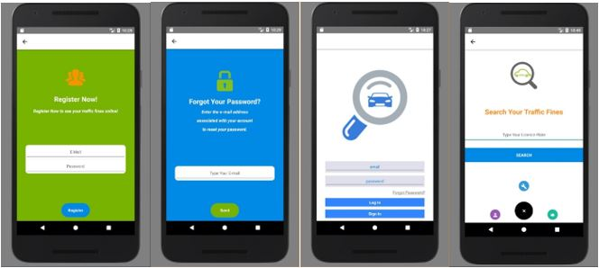
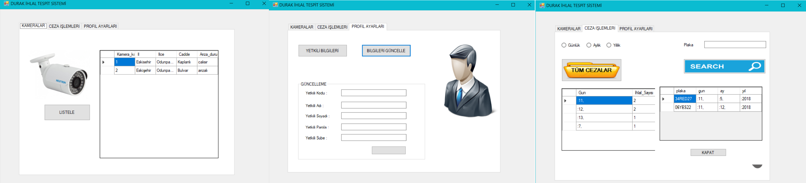

# BusStopViolationDetection
Developed with <a href="https://github.com/AkbulutSemiha">Semiha Akbulut</a> , using License Plate Recognition System

In this project, we used Raspberry Pi3, so you can visit <a href="https://www.pyimagesearch.com/2017/09/04/raspbian-stretch-install-opencv-3-python-on-your-raspberry-pi/">here</a> for OpenCV installation on your Raspberry Pi.

Project designed for two different users. One of them is administrator, and the other one is user. The interfaces that two system users access are designed separately. Mobile application (developed by <a href="https://github.com/pinarkocak>me.</a>) was used for users and C# application (developed by <a href="https://github.com/AkbulutSemiha">Semiha Akbulut</a>) was used for administrators. You can see screenshots right below:

   

Firebase, which is compatible with the mobile applications that Google provides, was used for the Mobile App. For administrator app, we used MsSQL.

For License Plate Recognition Python code, you can look <a href="">here.</a>
